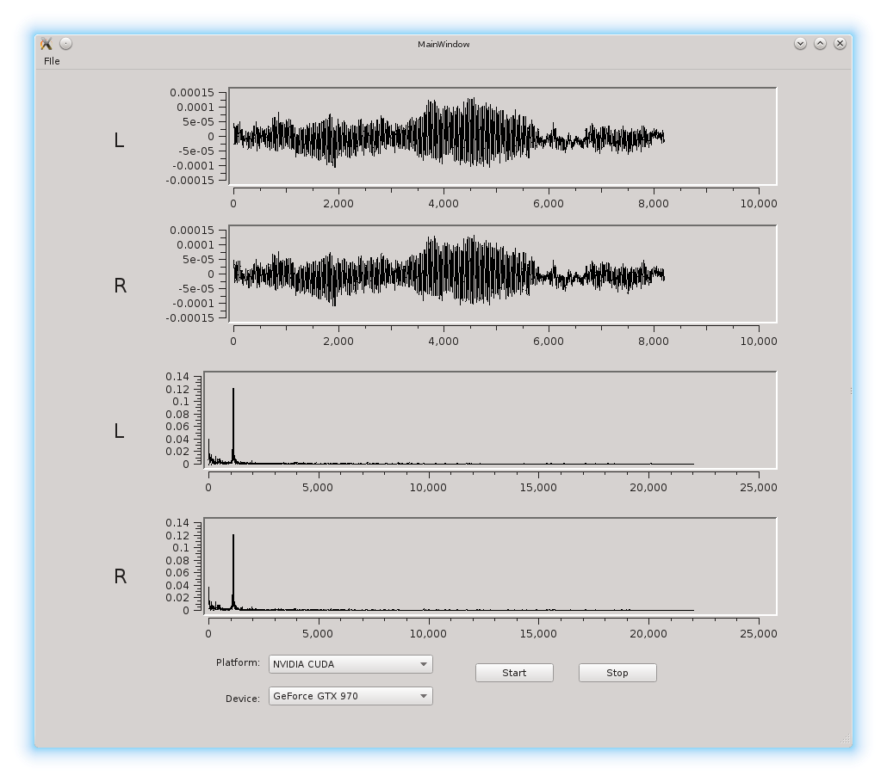

# pcmdft
In an effort to become familiar with OpenCL development this is a combination of [qarecord](http://alsamodular.sourceforge.net/) and the 
DFT example from [OpenCL in Action](http://www.manning.com/scarpino2/) chapter 14.  

It takes (ALSA) microphone input and displays the frequency components in QwtPlots.

